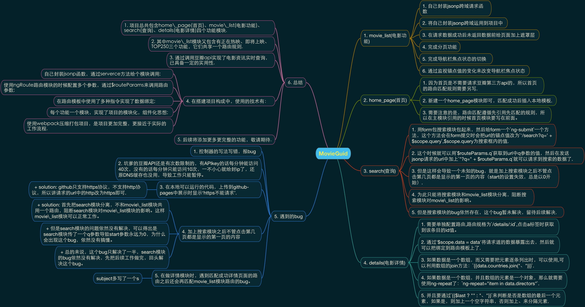

# Movie Guide


## [**demo**](https://yan7.github.io/MovieGuide/app/index.html)

## 项目简介
  这是使用angular构建的一个单页面应用，通过调用豆瓣api实现了实时请求数据，是一个真正可用的电影查询网站.每个功能一个模块，实现了项目的模块化，组件化思想，同时使用了webpack打包项目,使项目更加完整，更接近于实际的工作流程.

## 项目思维导图



## 遇到的bug

1. 控制器的写法写错，报bug
2. 坑爹的豆瓣API还是有次数限制的，有APIkey的话每分钟能访问40次，没有的话每分钟只能访问10次，一不小心就给封ip了，还原DNS缓存也没用，导致工作只能暂停。
3. 在本地可以运行的代码，上传到github-pages中展示时显示‘https不能请求’.
  + solution: github只支持https协议，不支持http协议，所以讲请求的url中的http改为https即可.
4. 加上搜索模块之后不管点击第几页都是显示的第一页的内容
  + solution: 首先把search模块分离，不和movie\_list模块共用一个路由，阻断search模块对movie\_list模块的影响。这样movie\_list模块可以正常工作。
  + 但是search模块的问题依然没有解决，可以得出是search模块传了一个q参数导致start参数永远为0，为什么会出现这个bug，依然没有搞懂。
  + 总的来说，这个bug只解决了一半，search模块的bug依然没有解决，先把后续工作做完，回头解决这个bug。
5. 在做详情模块时，遇到匹配成功详情页面的路由之后还会再匹配movie_list模块路由的bug。
  + solution: 是因为自己在详情模块的发送jsonp请求的时候时候url写错了
  ```javascript
  // right
  https://api.douban.com/v2/movie/subject/' + $routeParams.id
  //wrong （subject多写了一个s）
  https://api.douban.com/v2/movie/subjects/' + $routeParams.id
  ```

## 理解过程

### 直接使用模板字符串
1. 当锚点值为in\_theaters时，路由匹配成功，输出文件路径，然后通过ng-view在页面上输出，这些路由器的工作都是由in\_theaters完成的，但是完成后通过在app.js输出工作内容.
2. ng-view的作用:把指定的模板字符串插入到ng-view中。

### 利用postman来请求到即时数据，在渲染到页面上
1. 利用控制器中的$scope将请求的数据暴露出来，在渲染到页面上,
2. 渲染图片时，如果直接使用src属性，浏览器会在angula未渲染图片前将src中的内容当做路径来请求，因为会报bug，解决方法是就src改为ng-src.同理，在angular中href属性也可以用ng-href来代替.
3. 渲染数据时，遇到json数据中含有数组的，可以使用数组的join方法，将数组按照指定的符号拆分成一个字符串。
	- join() 方法用于把数组中的所有元素放入一个字符串。
	- 元素是通过指定的分隔符进行分隔的，如果不传参则默认使用逗号分隔。
4. 基本思路搞清楚了，都是匹配路由，就是匹配锚点值，当匹配成功后就将该路由的模板文件的内容渲染到页面中，三个模块都是这样的。

### 利用控制器的$http参数的get方法发送ajax请求获取本地json数据
1. 要想在angular中发送ajax请求，必须给控制器中传入$http参数。
2. angular中发送ajax的方法$http，其中又有两个简便分方法get和post，然后可以通过then方法执行回调函数。
3. then方法的第一个参数为成功的回调函数，第二个参数哦为失败的回调函数.
4. 将数据保存在一个json文件中，利用ajax请求获取数据并渲染在页面，可以让页面减少很多代码，简洁又实用.

### 利用jsonp调用豆瓣API完成实时数据渲染

#### 自己封装jsonp跨域请求函数
1. 由于豆瓣api规定接受的callback参数只能包含数字、字母、下划线，长度不大于50，所以angular自带的跨域方法jsonp由于callback参数是带有.的，所以在这里直接用jsonp方法调用豆瓣API会失败，必须自己封装一个jsonp跨域方法.
2. 创建myJsonp函数，其中有三个参数
	+ url: 请求的路径，这里是豆瓣API的地址;
	+ arg: 请求的参数，这个参数是由豆瓣API提供的，一个是start：从第几条数据开始返回，count： 返回几条数据;
	+ fn: 请求成功的回调函数,因为fn是一个匿名函数，所以将其拼接到url中的时候要先给它一个名字mycallbackName.
3. 首先需要合并参数到url中，这里需要合并arg的参数和angular要求的callback参数,都是使用拼接字符串的方法.
4. 为了防止调用多次的时候后面的回调函数覆盖了前面的回调函数，这样会使多次请求的数据就都被最后一次请求的数据覆盖了。所以每次都要给fn函数一个随机名字
5. 为了让mycallbackName可以全局作用，可以让它成为window的一个属性，这样它就是全局作用域了.
6. 为了避免调用多次之后生成很多个script标签所以要在请求数据成功并返回数据之后移出该script标签，所以把mycallbackName作为一个函数执行，每次请求成功并改回数据后则移除该script标签.
7. 以下是myJsonp函数的完整代码(注释在源码里有):
```javascript
function myJsonp(url, arg, fn) {
  var queryString = '';
  for (var key in arg) {
  	queryString += key + '=' + arg[key] + '&';
  }
  url = url + '?' + queryString;
  var mycallbackName = "jsonp_" + Math.random().toString().substr(2);

  window[mycallbackName] = function(data) {
    fn(data);
    document.body.removeChild(scriptEle);
  }

  url = url + "callback=" + mycallbackName;

  var scriptEle = document.createElement('script');
  scriptEle.src = url;
  document.body.appendChild(scriptEle);
    }
```

#### 将自己封装jsonp跨域运用到项目中
1. 先创建一个http-server模块，通过service创建一个服务，将封装的myjsonp函数放进去
  + 需要注意的是，angular中有自己的全局对象$window，要用这个来代替window
  + 在index页面中也需要引入这个模块
2. 接着在需要用到跨域请求数据的模块中注入这个模块,因为需要通过控制器暴露请求到的数据，所以在控制器中也需要注入这个模块。
3. 因为angular请求数据是异步的，而js执行是同步的，所以angular不能自动检测到数据模型已发生改变并渲染数据。
4. 所以直接通过`$scope.data = data`不会报错，但angular不会将新的数据模型渲染到页面上.
5. 要解决这个办法，需要在回调函数的最后面加上`$scope.$apply()`.
6. 注意：在angular中，但凡是异步操作，都需要`$scope.$apply()`这一句代码。

#### 在请求数据成功后未返回数据前给页面加上遮罩层
1. google‘css loading’可以得出很多个css遮罩层，选择其中一种将代码复制进自己的项目即可
2. 将html贴在数据渲染模板中，自己可以根据需求更改一些css样式。
3. 给遮罩层div盒子加上`ng-show=loading`,一开始在控制器中设置`$scope.loading = true`,在请求回调函数中设置`$scope.loading = false`，即可实现在加载数据时展现，在数据加载完成后消失.


#### 完成分页功能
1. 路由规格写成`'/in_theaters/:page?'`表示动态匹配页码，加上？号表示匹配不写页码的情况
2. 通过豆瓣API提供的start和count参数来控制页码:
```javascript
  // 开始进行分页处理
  var count = 10; // 每页渲染的数据
  var page = $routeParams.page || '1' - 0; // -0 是为了将page从字符串转为整型
  var start = (page - 0) * count;
```
3. 通过给两个点击按钮加上`ng-class="{'disable': nowPage <= 1}"`或`ng-class="{'disable': nowPage >= maxPage}"`来控制不能点击的效果。
4. in\_theaters模块做好之后，其它两个模块也是一样的代码，只需要in\_theaters模块赋值黏贴两份，然后把文件名字和代码里面的模块名字和控制器名字改为对应的模块名字就行了。

#### 合并分页功能
1. 三个模块的功能、代码都是类似的，如果可以合并代码将使项目更加简洁健康.
2. $routeParams在使用路由参数时可以使用多个参数,而三个模块的主要不同点在于url中锚点值的不同，那么就可以将url中的锚点值作为一个参数，让路由去动态匹配,就可以实现代码合并了.
3. 将路由规格改为`/:moduleName/:page?`，然后将跨域请求数据的url值改为`https://api.douban.com//v2/movie/" + $routeParams.moduleName`,就实现了点击不同的url时，angular动态匹配锚点值，然后将匹配到锚点值拼接到跨域请求的url中即可.

#### 完成导航栏焦点状态的切换
1. 使用自定义指令`auto-active`来完成这个功能.
2. 创建一个auto-active模块来写导航栏焦点状态的切换.
3. 通过direcitve属性来创建一个自定义指令，同时return一个json数据格式的数据.
4. 通过link属性来指定一个方法用于对自定义指令所在标签进行处理.
5. element是自定义指令所在标签的jQuite对象，即控制这个属性就是在控制自定义指令所在的标签.在这里给element加一个点击事件即可以完成功能.

#### 通过监视锚点值的变化来改变导航栏焦点状态
1. 因为用户可以直接通过改变url来改变页面内容，这时候按钮的点击事件就不起作用了，所以最保险的方法是导航栏的焦点通过url锚点值的变化而变化.
2. 通过自定义指令的`scope.whtch`，可以监视url锚点值的变化，但是它只能监视scope的属性，所以需要将$location赋值给scope.
3. 通过`var hash = element.children()[0].href.split('#')[1]`可以获得当前当前a标签的锚点值.
4. 接着利用h5的新属性`startsWith`来匹配u当前url是否已当前当前a标签的锚点值开始的。
5. 如果返回true，则给当前li标签加上焦点样式，同时移除其兄弟元素的焦点样式。

#### 完成首页模块
1. 因为首页是不需要请求豆瓣第三方api的，所以首页的路由匹配规则需要另写.
2. 新建一个home_page模块即可，匹配成功后插入本地模板.
3. 需要注意的是，路由匹配遵循先引用先匹配的规则，所以在主模块引用的时候首页模块要写在前面。
4. 在app.js中使用otherwise来使页面默认跳转到首页.
5. 后期又给首页模块增加了轮播图和北美票房榜模块.

#### 完成搜索模块
1. 用form包搜索模块包起来，然后给form一个`ng-submit`一个方法，这个方法会在form提交时会把url的锚点值改为`'/search?q=' + $scope.query`,$scope.query为搜索框内的值.
2. 这个时候就可以用`$routeParams.q`获取到url中q参数的值，然后在发送jsonp请求的url中加上`"?q=" + $routeParams.q`就可以请求到搜索的数据了.
3. 但是这样会导致一个未知的bug，就是加上搜索模块之后不管点击第几页都是显示的第一页的内容（start的设置失效，总是以0开始）.
4. 为此只能将搜索模块和movie_list模块分离，阻断搜索模块对movie\_list的影响。
5. 但是搜索模块的bug依然存在，这个bug暂未解决，留待后续解决.

#### 完成详情模块
1. 需要单独配置路由,路由规格为`/details/:id`,点击a标签时获取到该条目的id值。
2. 通过'$scope.data = data'将请求道的数据暴露出去，然后就可以把绑定到路由模板上了.
3. 如果数据是一个数组，而又需要把元素逐条列出时，可以使用,可以利用数组的join方法：`{{data.countries.join("、")}}`.
4. 如果数据是一个数组，并且数组的元素是一个对象，那么就需要使用ng-repeat了：`ng-repeat="item in data.directors"`.
5. 并且要通过`{{$last ? "" : "、"}}`来判断是否是数组的最后一个元素，如果是，则加上一个空字符串，否则加上、来分隔元素.

#### 项目完善
1. 利用不同的字体颜色做了一个简单的logo.
2. 利用c3新属性vw，vh和媒体查询做了响应式.是页面同时在手机，平板，pc端都能够很好的展示内容.


## 项目总结
1. 项目总共包含home\_page(首页)、movie\_list(电影功能)、search(查询)、details(电影详情)四个功能模块.
2. 其中movie\_list模块又包含有正在热映、即将上映、TOP250三个功能，它们共享一个路由规则.
3. 通过调用豆瓣api实现了电影资讯实时查询，已具备一定的实用性.
4. 在搭建项目构成中，使用的技术有：
  + 自己封装jsonp函数，通过serverce方法给个模块调用;
  + 使用ngRoute路由模块的时候配置多个参数，通过$routeParams来调用路由参数;
  + 在路由模板中使用了多种指令实现了数据绑定;
  + 每个功能一个模块，实现了项目的模块化，组件化思想;
  + 使用webpack压缩打包项目，使项目更加完整，更接近于实际的工作流程.
5. 后续将添加更多更完整的功能，敬请期待.
